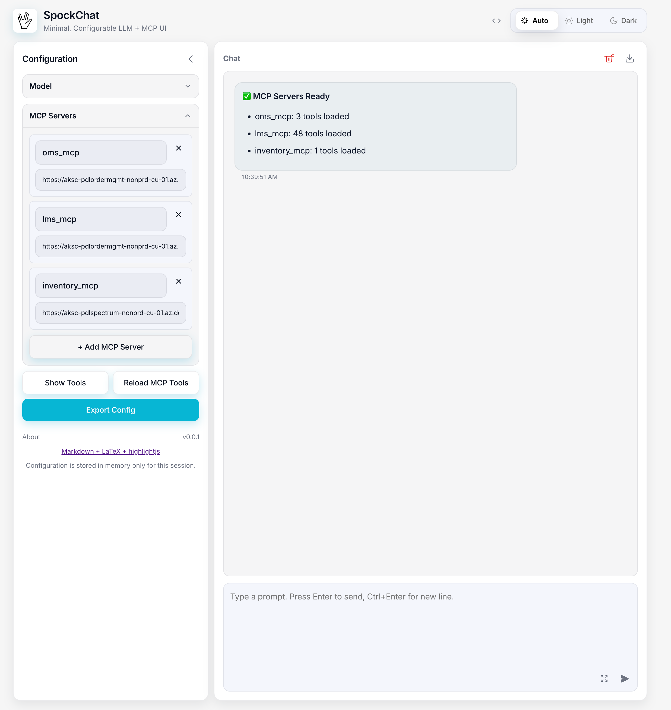

# SpockChat

Minimal, configurable LLM + MCP UI (Node.js + static frontend) with Markdown/LaTeX rendering, tool support, and streaming responses.

Features
- Configure model type: mock, OpenAI, Azure AI Foundry, or Local LMStudio.
- MCP servers via HTTP JSON-RPC or stdio.
- Streaming responses (SSE) with unified Markdown + LaTeX rendering.
- Message details modal with request/response, copy buttons, and LMStudio response IDs.
- About modal listing open-source packages and versions.

## UI Features

SpockChat provides a clean, modern interface with powerful features for an optimal chat experience:



### Theme Support
- **Auto, Light, and Dark modes** - Automatically adapts to your system preferences or choose your preferred theme
- Persistent theme selection across sessions

### Customizable Layout
- **Collapsible sidebar** - Toggle the configuration panel for distraction-free chatting
- **Full-width mode** - Expand chat area to utilize the entire viewport
- **Expandable input area** - Grow the input box for composing longer messages

### Code Display Options
- **Code wrapping toggle** - Enable/disable code wrapping in code blocks for better readability
- Syntax highlighting for multiple programming languages

### Configuration Panels
- **Collapsible accordions** for Model and MCP server settings
- Quick access to model configuration and MCP server management
- State persistence - UI preferences are automatically saved to `~/.spockchat/ui-settings.json`

### Advanced Features
- **Markdown and LaTeX rendering** - Full support for formatted text, tables, lists, and mathematical equations
- **Message details modal** - View complete request/response data with copy buttons
- **Tool call support** - Visual indicators and detailed information for MCP tool interactions
- **Streaming responses** - Real-time message rendering with Server-Sent Events (SSE)
- **About modal** - View all open-source dependencies and their versions

### Keyboard-Friendly
- All UI controls are accessible via keyboard navigation
- Standard keyboard shortcuts for common actions

Quick start
1. Install dependencies:

```bash
cd /path/to/spockchat
npm install
```

2. Configure environment (optional):

```bash
cp .env.example .env
cp spockchat-mcp-config.example.json ~/.spockchat/spockchat-mcp-config.json
```

**Note:** Configuration files are stored in `~/.spockchat/` directory. On first run, any existing config files in the project directory will be automatically migrated.

3. Start server:

```bash
npm start
```

4. Open `http://localhost:5050` in your browser.

Usage notes
- LMStudio uses `previous_response_id` for context; the client persists the latest response ID and sends it on subsequent prompts.
- Render test page: `http://localhost:5050/render-test.html` (uses the same renderer as the chat UI).
- Configuration files are stored in `~/.spockchat/` directory:
  - `spockchat-mcp-config.json` - MCP server configuration
  - `ui-settings.json` - UI preferences (theme, sidebar, accordions, code wrap)
- Logging is controlled by `LOGLEVEL` and optional flags: `LOG_LLM_REQUEST`, `LOG_LLM_RESPONSE`, `LOG_TOOL_REQUEST`, `LOG_TOOL_RESPONSE`, `LOG_TO_FILE`.

Security
- This prototype stores configuration in `~/.spockchat/` directory and sensitive data in memory. Do not expose sensitive keys; use secure storage and HTTPS in production.

## License

SpockChat is released under the [MIT License](LICENSE). See the [Third-Party Licenses](THIRD-PARTY-LICENSES.md) for information about dependencies.

## Contributing

We welcome contributions! Please read our [Contributing Guidelines](CONTRIBUTING.md) before submitting a pull request.

## Support

- 🐛 [Report a bug](https://github.com/PDL-kaushal/spockchat/issues)
- 💡 [Request a feature](https://github.com/PDL-kaushal/spockchat/issues)
- 📖 [Documentation](https://github.com/PDL-kaushal/spockchat)


## Hyper-Minimal Chat UI with configurable LLM Models and MCP Servers

